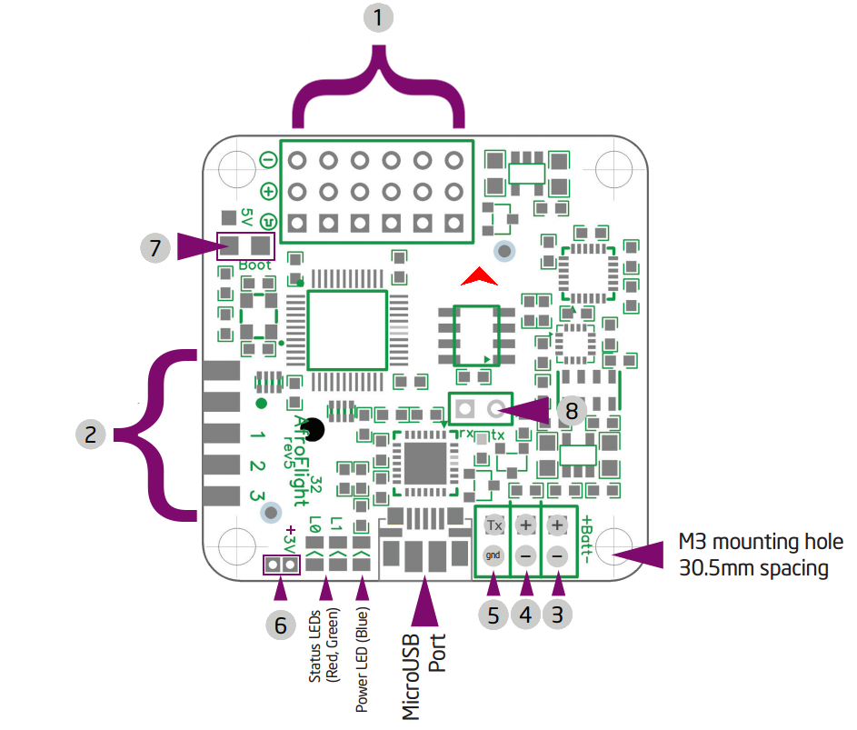
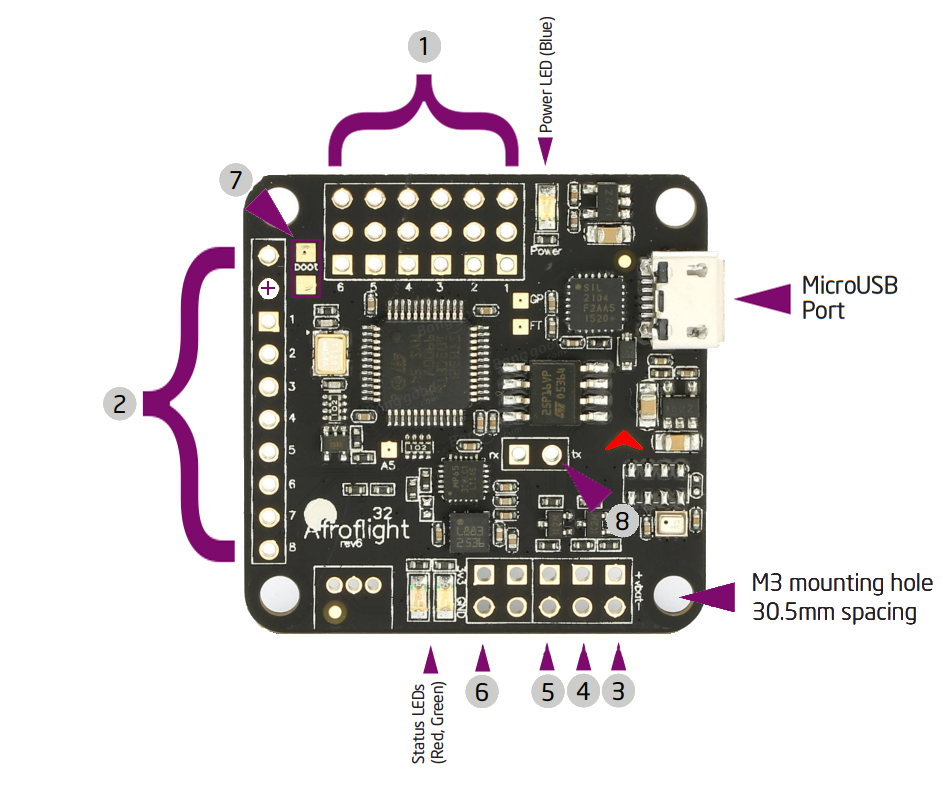
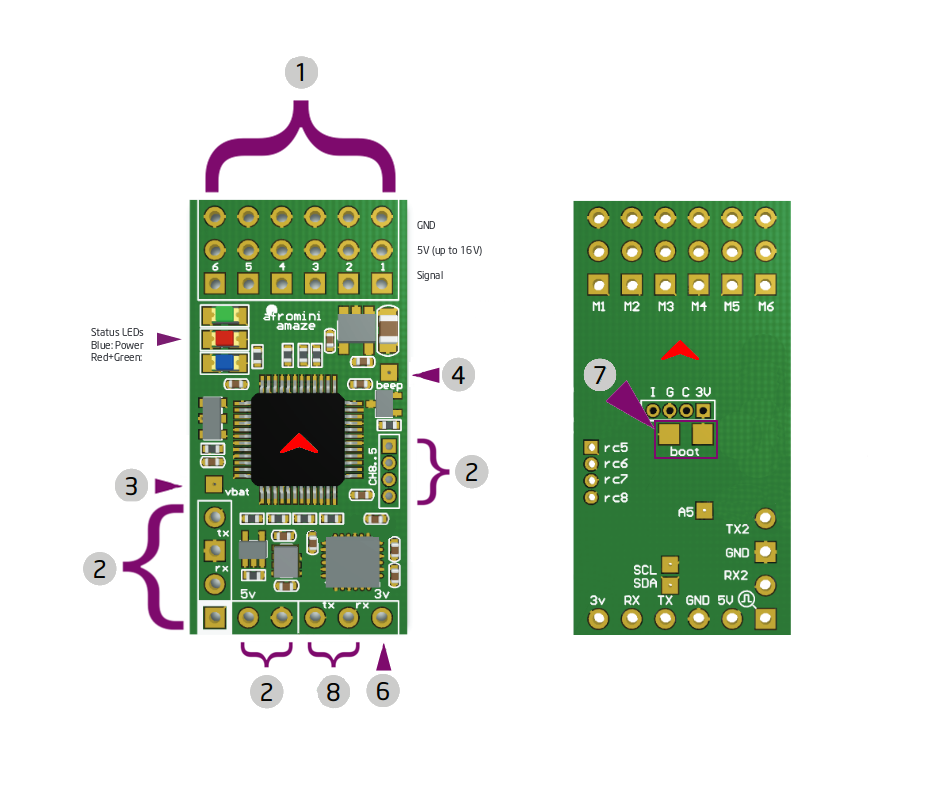

# Supported Devices

## Naze32 Rev5
The Naze32 Rev5 is the recommended device in terms of support and stability.

#### Compiling
Use the flag `NAZE32_REV5` compile flag while compiling and flashing.

#### Pinout
1. PWM motor outputs (motor numbers on back)
2. Auxilary outputs
  - GND
  * 5V
  1. NC
  2. NC
  3. NC
  4. NC
  5. NC
  6. NC
  7. NC
  8. NC
3. Battery Monitor (NC)
4. Buzzer
5. Secondary Tx(?) output (NC)
6. 3.3V output (100mA max)
7. Booloader Pins (short to enter bootloader during power on)
8. UART1 Tx/Rx

## Naze32 Rev6
The Naze32 Rev6 features a nicer pinout profile, and may be easier to find in stock.

#### Compiling
Use the flag `NAZE32_REV6` compile flag while compiling and flashing.

#### Pinout

## Naze32 Mini Rev3
The Naze32 Mini Rev3 is a miniturized design of the Naze32 Rev5.

#### Compiling
Use the flag `NAZE32_REV5` compile flag while compiling and flashing.

#### Pinout
